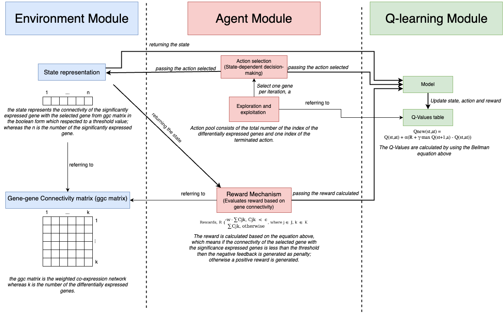

# Q-learning for Selection of Genetic Markers Associated with Acne
Using Q-learning to Identify Genetic Markers in Acne Gene Expression Data


## Table of Contents
- [Overview](#overview)
- [Module Architecture](#module-architecture)
- [Installation](#installation)
- [Prerequisites](#prerequisites)
- [Usage](#usage)
- [File Structure](#file-structure)
- [License](#license)

## Overview
This project applies Q-learning, a type of reinforcement learning, to identify genetic markers associated with acne from gene expression datasets. The code processes gene expression data and trains a Q-learning model to select the most relevant genes.

## Module Architecture
The diagram below shows the high-level architecture of the model, including data loading, Q-learning training loop, and output generation:



## Prerequisites
- Python 3.8 or higher
- R 4.0 or higher (for data preprocessing)
- Basic understanding of reinforcement learning concepts

## Installation
To run the code, first clone the repository and install the dependencies.
```
git clone https://github.com/yourusername/genetic-markers-acne.git
cd genetic-markers-acne
pip install -r requirements.txt
```

## Usage
To execute the Q-learning model on one of the provided datasets, use the following command:
```
python qlearning_acne.py --dataset GSE108110
```
You can replace GSE108110 with other dataset identifiers like GSE53795 or GSE6475 as needed.

## Data Preparation
Prepare your dataset in the required format. Example datasets can be downloaded from [GEO](https://www.ncbi.nlm.nih.gov/geo/).

## File Structure
```
├── qlearning_acne.py       # Main script to run Q-learning
├── requirements.txt        # Python dependencies
├── README.md               # Project documentation
```

## License
This project is licensed under the CC BY-NC-ND 4.0 License.
